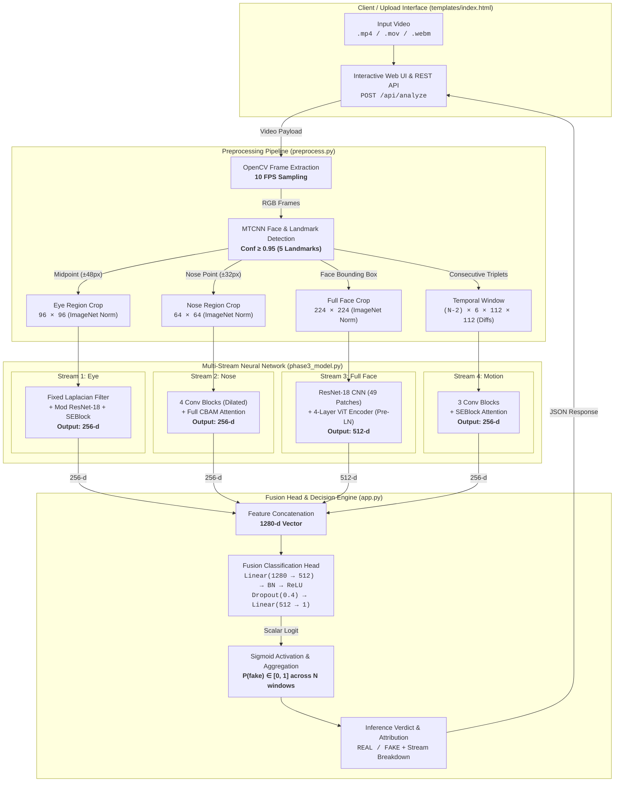

# VERITAS: Multi-Stream Deepfake Detection Framework

VERITAS is a deep learning system for facial manipulation detection in video sequences. It combines localized spatial facial artifact analysis, high-frequency filtering, vision transformer global reasoning, and inter-frame temporal motion modeling to detect synthetic and manipulated facial media.

---

## Overview

Deepfake synthesis algorithms frequently produce subtle, heterogeneous artifacts: high-frequency blending boundaries around facial features, structural asymmetries across the global facial geometry, and inter-frame motion jitter. VERITAS decomposes video inputs into aligned spatial and temporal streams, processing them through specialized neural sub-networks before performing joint multi-modal fusion.

---

## Problem Statement

Traditional single-frame and monolithic CNN detectors struggle to simultaneously capture localized boundary artifacts (e.g., around the eyes and nose) and temporal discontinuities (e.g., unnatural blinking or frame-to-frame warping). VERITAS addresses this by:
1. Extracting landmark-guided ocular and nasal regions to isolate blending boundaries.
2. Employing depthwise Laplacian high-pass filtering to reveal frequency anomalies.
3. Leveraging Vision Transformer self-attention to assess full-face structural coherence.
4. Computing differential motion tensors to capture inter-frame temporal inconsistencies.

---

## Key Features

- **Multi-Stream Architecture**: 4 specialized neural streams processing eye crops, nose crops, full faces, and temporal motion difference maps.
- **Biometric Landmark Alignment**: MTCNN-driven landmark extraction for eye-centered and nose-centered sub-regions.
- **Hybrid CNN-Transformer Modeling**: ResNet-18 feature extraction combined with a 4-layer Vision Transformer Encoder for global facial symmetry analysis.
- **Inter-Frame Temporal Stream**: 6-channel motion difference tensors capturing inter-frame jitter across consecutive frames.
- **Explainable Stream Attribution**: Quantifies the contribution percentage of each neural stream toward the final manipulation verdict.
- **Flask Web Application & REST API**: Interactive web UI and REST API endpoint (`/api/analyze`) for video upload and inference.

## System Architecture



---

## Technology Stack

- **Deep Learning**: PyTorch (`torch>=2.1.0`), Torchvision (`torchvision>=0.16.0`)
- **Face Detection & Landmarks**: MTCNN via `facenet-pytorch>=2.5.3`
- **Computer Vision**: OpenCV (`opencv-python>=4.9.0`)
- **Data Containers & Processing**: `h5py>=3.9.0`, `numpy>=1.26.0`
- **Metrics & Utilities**: `scikit-learn>=1.4.0`, `matplotlib>=3.8.0`, `tqdm>=4.66.0`
- **API & Web Backend**: Flask (`flask>=3.0.0`), Flask-CORS (`flask-cors>=4.0.0`)
- **Hardware Acceleration**: CUDA (automatic GPU execution with CPU fallback)

---

## Project Structure

```text
deepfake/
├── app.py                     # Flask web server and REST API implementation
├── phase3_model.py            # Neural network architectures, attention modules & dataset loaders
├── preprocess.py              # Single-video & dataset preprocessing via MTCNN and OpenCV
├── pipeline.html              # Project development journal & milestone documentation
├── requirements.txt           # Python dependencies
├── veritas favicon.jpeg       # Application icon
├── .gitignore                 # Environment and checkpoint ignore rules
├── docs/                      # Technical documentation
│   ├── architecture.md        # Comprehensive pipeline dataflow specification
│   ├── dataset.md             # Dataset layout, HDF5 schema & augmentation rules
│   ├── preprocessing.md       # Preprocessing hyperparameters & landmark formulas
│   ├── model.md               # Model parameters, layer breakdown & attention blocks
│   ├── training.md            # Differential optimization, loss & schedule details
│   ├── evaluation.md          # Benchmark results & stream attribution math
│   └── inference.md           # Programmatic Python API & REST API usage
├── models/
│   ├── README.md              # Checkpoint specification and placement guide
│   └── best_model.pt          # PyTorch model checkpoint (Epoch 42)
└── templates/
    └── index.html             # Web user interface
```

---

## Dataset

VERITAS is built and benchmarked on subsets of the **FaceForensics++** dataset:
- **Format**: Per-video HDF5 (`.h5`) files containing 4 dataset keys: `full_face`, `eye_crop`, `nose_crop`, and `temporal`.
- **Classes**: `Real` (label `0.0`) and `Fake` (label `1.0`).
- **Splits**: `Training/`, `Validation/`, and `Testing/` directories.
- **Augmentation**: Random horizontal flipping ($p=0.5$) and 90° discrete rotations synchronized across streams via a single random seed.

For full schema details, see [docs/dataset.md](file:///c:/Users/welcome/Desktop/vscode/deepfake/docs/dataset.md).

---

## Data Preprocessing

Implemented in `preprocess.py` via `InferencePreprocessor`:
1. **Frame Extraction**: Fixed downsampling to **10 FPS** using `frame_interval = round(original_fps / 10)`.
2. **Face & Landmark Detection**: MTCNN detects bounding box and 5 facial landmarks with confidence threshold $\ge 0.95$.
3. **Region Cropping**:
   - `full_face`: Resized to **224×224**, ImageNet normalized.
   - `eye_crop`: Center point between left and right eyes (±48px radius) resized to **96×96**, ImageNet normalized.
   - `nose_crop`: Center point at nose landmark (±32px radius) resized to **64×64**, ImageNet normalized.
   - `temporal`: Motion differences $\text{diff}_1 = |f_{t+1} - f_t|$ and $\text{diff}_2 = |f_{t+2} - f_{t+1}|$ resized to **6×112×112**.

For mathematical formulations, see [docs/preprocessing.md](file:///c:/Users/welcome/Desktop/vscode/deepfake/docs/preprocessing.md).

---

## Model Architecture

`DeepfakeMultiStreamModel` contains **28,102,974 total parameters** (28,102,947 trainable):
- **EyeStream (11.34M params)**: Depthwise fixed Laplacian high-pass filter $\to$ Modified ResNet-18 (stride-1 first conv, no maxpool) with Squeeze-and-Excitation (SE) blocks $\to$ 256-d output.
- **NoseStream (1.04M params)**: 4-stage convolutional network with dilated convolutions and CBAM attention $\to$ 256-d output.
- **FullFaceHybridStream (14.61M params)**: ResNet-18 CNN feature extractor ($49$ patches) $\to$ 4-layer Vision Transformer Encoder (8 heads, $d_{\text{model}}=256$, Pre-LN) with `[CLS]` token $\to$ 512-d output.
- **TemporalStream (0.46M params)**: 3-stage convolutional network with SE attention processing 6-channel difference maps $\to$ 256-d output.
- **Fusion Head (0.66M params)**: Concatenates features ($1280\text{-d}$) $\to \text{FC}(1280 \to 512) \to \text{BN} \to \text{ReLU} \to \text{Dropout}(0.4) \to \text{FC}(512 \to 1)$ raw logit.

For architectural breakdowns and parameter counts, see [docs/model.md](file:///c:/Users/welcome/Desktop/vscode/deepfake/docs/model.md).

---

## Training

- **Loss Function**: `nn.BCEWithLogitsLoss()`
- **Optimizer**: Adam / AdamW with 3 differential learning rate groups:
  - `backbone`: `1e-5` (ResNet-18 CNN layers)
  - `attention`: `1e-4` (SE blocks, CBAM, Transformer encoder)
  - `head`: `3e-4` (Fully-connected classifiers & conv stems)
- **Schedule**: Initial warm-up with frozen backbones (`model.freeze_backbones()`) followed by full fine-tuning (`model.unfreeze_backbones()`).
- **Batch Size**: 8 (training data loader)

For training scripts and schedules, see [docs/training.md](file:///c:/Users/welcome/Desktop/vscode/deepfake/docs/training.md).

---

## Evaluation

Verified checkpoint benchmark metrics at **Epoch 42** (`models/best_model.pt`):

| Metric | Checkpoint Value |
|---|---|
| **Validation ROC-AUC** | **0.8805** (88.05%) |
| **Validation F1-Score** | **0.7806** (78.06%) |
| **Validation Accuracy** | **0.7838** (78.38%) |
| **Decision Threshold** | $\tau = 0.5$ |

For evaluation protocols and explainability math, see [docs/evaluation.md](file:///c:/Users/welcome/Desktop/vscode/deepfake/docs/evaluation.md).

---

## Inference

Inference processes video files through `InferencePreprocessor` and batches sliding windows through `DeepfakeMultiStreamModel` (default batch size: 32). The video verdict is computed by averaging window probabilities:

```python
from phase3_model import DeepfakeMultiStreamModel
from preprocess import InferencePreprocessor
import torch

device = "cuda" if torch.cuda.is_available() else "cpu"
preprocessor = InferencePreprocessor(device=device)
(ff, ec, nc, tm), n_windows = preprocessor.process_video("sample.mp4")
```

For complete code examples, see [docs/inference.md](file:///c:/Users/welcome/Desktop/vscode/deepfake/docs/inference.md).

---

## API / Web Application

VERITAS includes a Flask web interface and REST API (`app.py`):

- **`GET /`**: Renders web UI dashboard (`templates/index.html`).
- **`GET /health`**: Returns server status, inference device, and model path.
- **`POST /api/analyze`**: Accepts `multipart/form-data` with field `video`. Returns JSON:
  ```json
  {
    "verdict": "FAKE",
    "confidence": 87.4,
    "windows": 18,
    "streams": {
      "eye": 34.2,
      "nose": 18.5,
      "face": 29.1,
      "temporal": 18.2
    }
  }
  ```

---

## Installation

1. Clone the repository and navigate to the root directory:
   ```bash
   git clone <repository_url>
   cd deepfake
   ```

2. Create and activate a Python virtual environment:
   ```bash
   python -m venv venv
   # Windows:
   .\venv\Scripts\activate
   # Linux / macOS:
   source venv/bin/activate
   ```

3. Install required dependencies:
   ```bash
   pip install -r requirements.txt
   ```

---

## Usage

### 1. Run Shape Validation Test
```bash
python -c "from phase3_model import run_shape_validation; run_shape_validation()"
```

### 2. Start the Web Server
```bash
python app.py --host 0.0.0.0 --port 5000
```
Open [http://127.0.0.1:5000](http://127.0.0.1:5000) in your web browser.

---

## Model Weights

The trained checkpoint `best_model.pt` must be located inside the `models/` directory:
```text
models/best_model.pt
```
For weight layout and dictionary specifications, see [models/README.md](file:///c:/Users/welcome/Desktop/vscode/deepfake/models/README.md).

---

## Limitations

- **Minimum Video Length**: Requires at least 3 readable frames with detected faces (at 10 FPS) to construct temporal difference tensors.
- **Face Visibility**: Heavily occluded, low-resolution, or profile faces (< 0.95 MTCNN confidence) are rejected by the preprocessor.
- **Single Dominant Face**: MTCNN is configured with `select_largest=True`, tracking the largest detected face in multi-person videos.

---

## Future Improvements

- Implementation of multi-face tracking across complex multi-subject scenes.
- Direct integration of frequency-domain discrete cosine transforms (DCT) into the spatial pipelines.
- Temporal modeling with recurrent networks or 3D convolutions for extended temporal receptive fields.

---

## Research / References

- FaceForensics++: Learning to Detect Manipulated Facial Images (*Rössler et al.*)
- Joint Face Detection and Alignment using Multi-task Cascaded Convolutional Networks (*Zhang et al.*)
- Squeeze-and-Excitation Networks (*Hu et al.*)
- CBAM: Convolutional Block Attention Module (*Woo et al.*)
- An Image is Worth 16x16 Words: Transformers for Image Recognition at Scale (*Dosovitskiy et al.*)

---

## License

This project is licensed under the MIT License.
