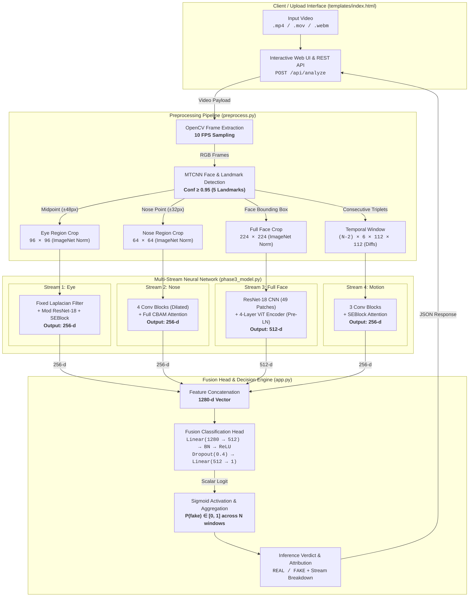

# VERITAS System Architecture

VERITAS is an end-to-end deepfake detection system designed to identify facial manipulation in video sequences by combining localized spatial artifact analysis with inter-frame temporal motion modeling.

---

## 1. High-Level Pipeline Flow

---

## 2. Pipeline Stages

### Stage 1: Frame Extraction (`preprocess.py`)
- The input video is opened with OpenCV (`cv2.VideoCapture`).
- Frames are sampled at a fixed target rate of **10 FPS** using a calculated interval: `frame_interval = round(original_fps / 10)`.
- Frames are converted from OpenCV's BGR to RGB color space.

### Stage 2: Face Detection & Landmark Extraction (`preprocess.py`)
- Multi-task Cascaded Convolutional Networks (MTCNN) detects facial bounding boxes and 5 key landmarks (`left_eye`, `right_eye`, `nose`, `mouth_left`, `mouth_right`).
- Detections with confidence below `0.95` are discarded.
- Videos with fewer than 3 detected faces are rejected.

### Stage 3: Multi-Region Spatial & Temporal Cropping (`preprocess.py`)
Four distinct representations are extracted per valid sliding window:
1. **Full Face**: Bounding box crop resized to **224×224**, normalized with ImageNet mean and standard deviation.
2. **Eye Region**: Crop centered between the left and right eyes (±48px radius) resized to **96×96**, normalized.
3. **Nose / Boundary Region**: Crop centered on the nose landmark (±32px radius) resized to **64×64**, normalized.
4. **Temporal Motion Difference**: Triplet difference across consecutive full-face frames $(t, t+1, t+2)$:
   $$\text{diff}_1 = |f_{t+1} - f_t|, \quad \text{diff}_2 = |f_{t+2} - f_{t+1}|$$
   Concatenated along channels into a 6-channel tensor and interpolated to **6×112×112**.

### Stage 4: Multi-Stream Neural Feature Extraction (`phase3_model.py`)
- **EyeStream (11.34M params)**: Isolates high-frequency blending and blinking artifacts via a frozen Laplacian kernel and modified ResNet-18 with Squeeze-and-Excitation (SE) attention. Output: **256-d**.
- **NoseStream (1.04M params)**: Analyzes boundary seam distortions using a 4-stage convolutional network augmented by Convolutional Block Attention Module (CBAM). Output: **256-d**.
- **FullFaceHybridStream (14.61M params)**: Extracts structural and semantic face coherence by combining a ResNet-18 CNN patch extractor with a 4-layer Vision Transformer Encoder. Output: **512-d**.
- **TemporalStream (0.46M params)**: Identifies inter-frame motion jitter and temporal inconsistencies using 3 convolutional blocks and SE attention. Output: **256-d**.

### Stage 5: Multi-Modal Fusion Head (`phase3_model.py`)
- The 4 stream outputs are concatenated into a **1280-dimensional** representation vector:
  $$\mathbf{z} = [\mathbf{z}_{\text{eye}} \, (256) \parallel \mathbf{z}_{\text{nose}} \, (256) \parallel \mathbf{z}_{\text{face}} \, (512) \parallel \mathbf{z}_{\text{temporal}} \, (256)]$$
- The vector is processed through:
  $$\text{FC}(1280 \to 512) \to \text{BatchNorm1d}(512) \to \text{ReLU} \to \text{Dropout}(p=0.4) \to \text{FC}(512 \to 1)$$
- Produces a single raw scalar logit.

### Stage 6: Probability Scoring & Stream Attribution (`app.py`)
- **Logit to Probability**: Each window logit is passed through $\sigma(x) = \frac{1}{1 + e^{-x}}$ to compute window-level $P(\text{fake})$.
- **Temporal Aggregation**: The video-level verdict is computed as the arithmetic mean of $P(\text{fake})$ across all $N$ valid windows:
  $$\bar{P}(\text{fake}) = \frac{1}{N} \sum_{i=1}^N P_i(\text{fake})$$
- **Stream Attribution**: Evaluates stream importance by computing the mean absolute activation of each stream projected through the first fusion weight matrix:
  $$\text{Score}_s = \frac{1}{B \cdot d_{\text{hidden}}} \sum \left| \mathbf{W}_{s} \mathbf{z}_s^\top \right|$$
  Normalized to sum to 100% to provide explainable per-stream contribution metrics.
